# Socket Event Flow Diagrams

## Complete Call Flow (Success Case)

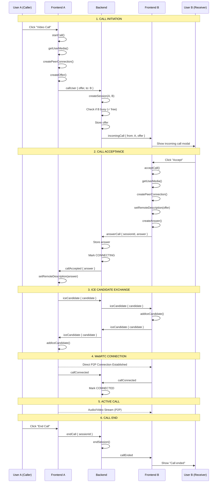

## Race Condition Resolution

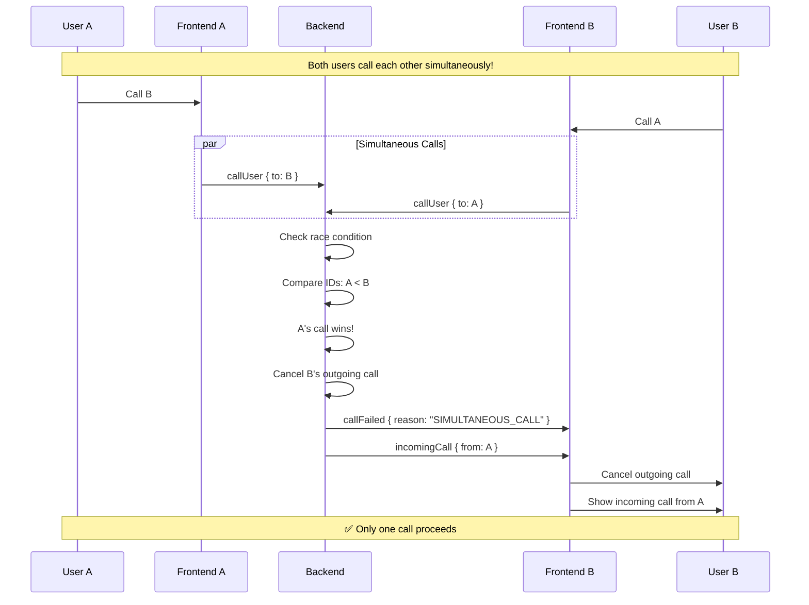

## Call Recovery After Refresh

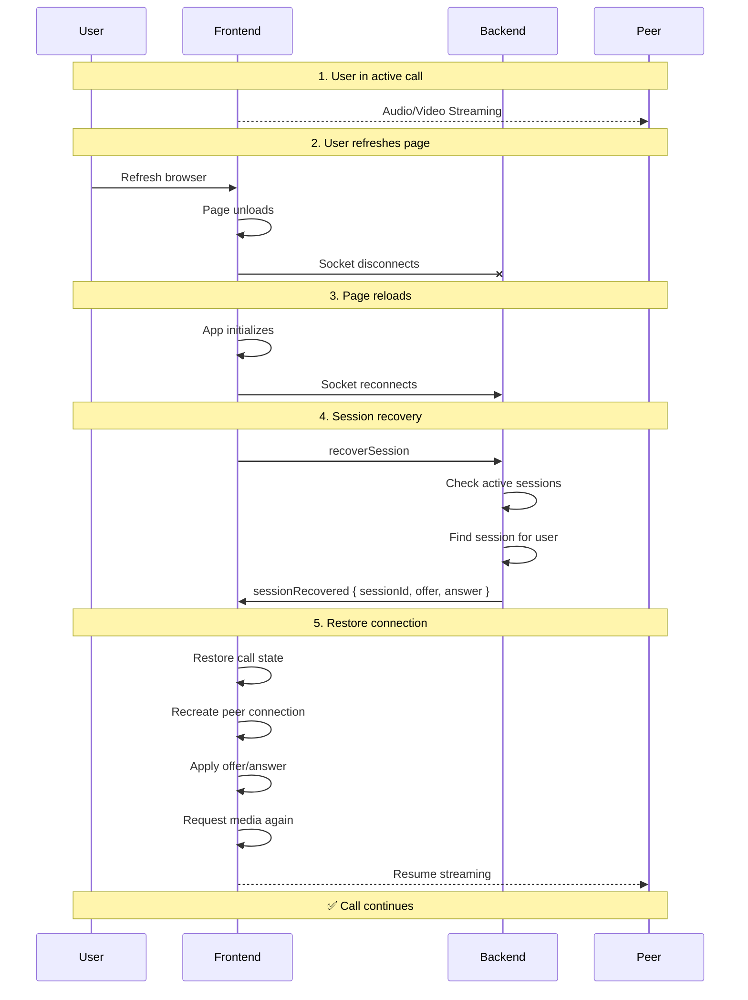

## Busy State Handling

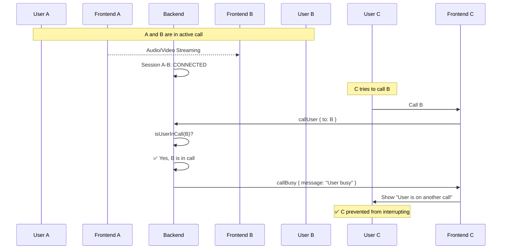

## Call Rejection Flow

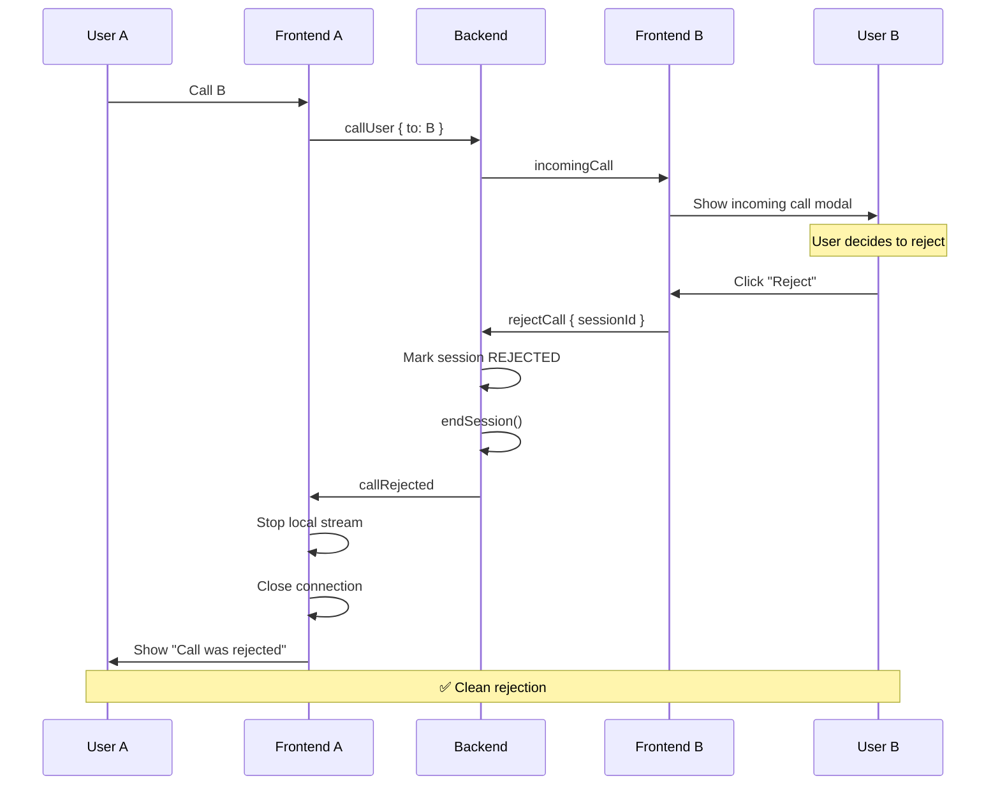

## Call Timeout (No Answer)

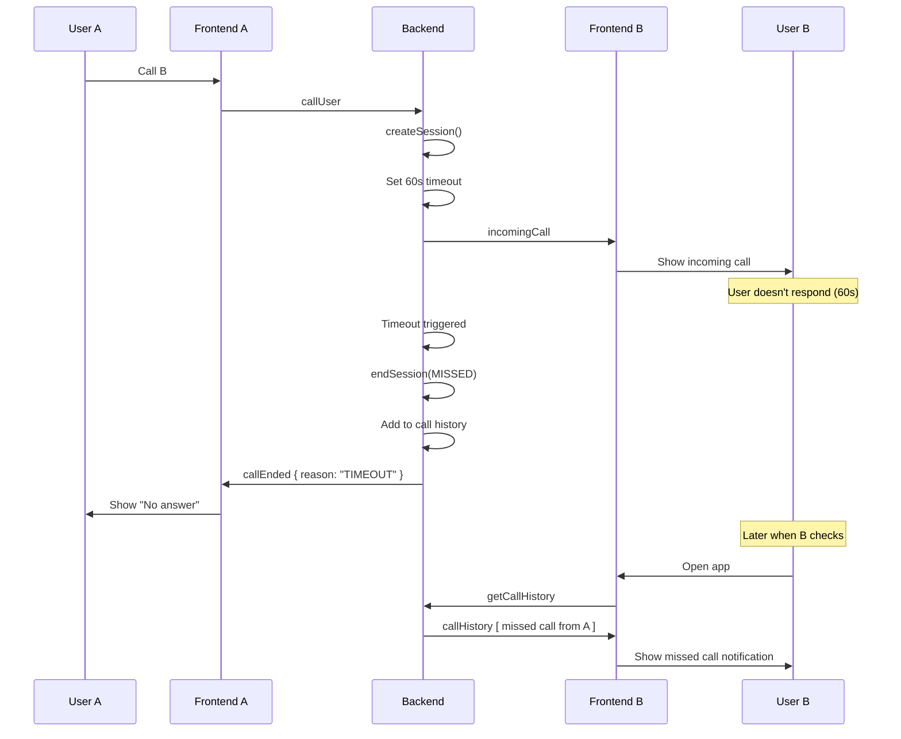

## Connection Failure Recovery

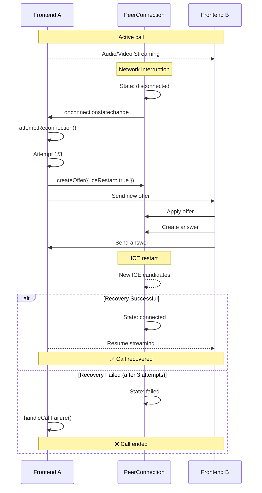

## User Offline Scenario

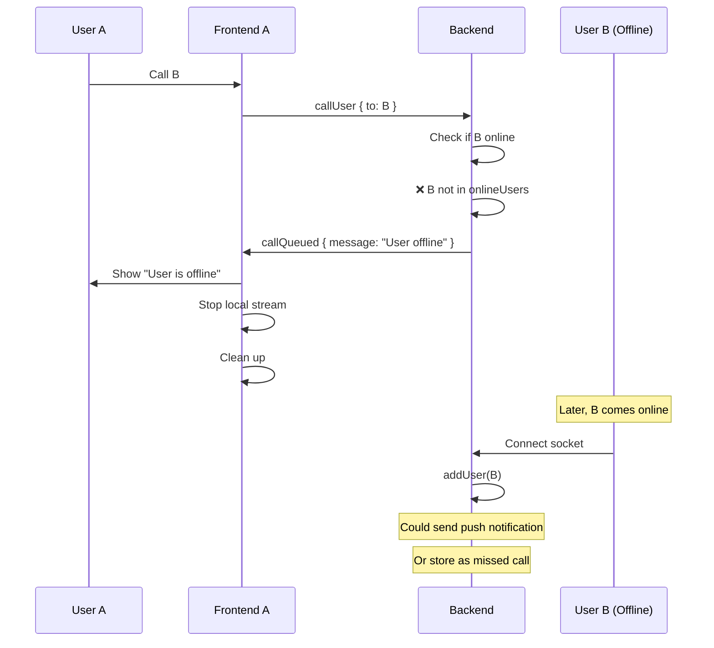

---

## State Transitions

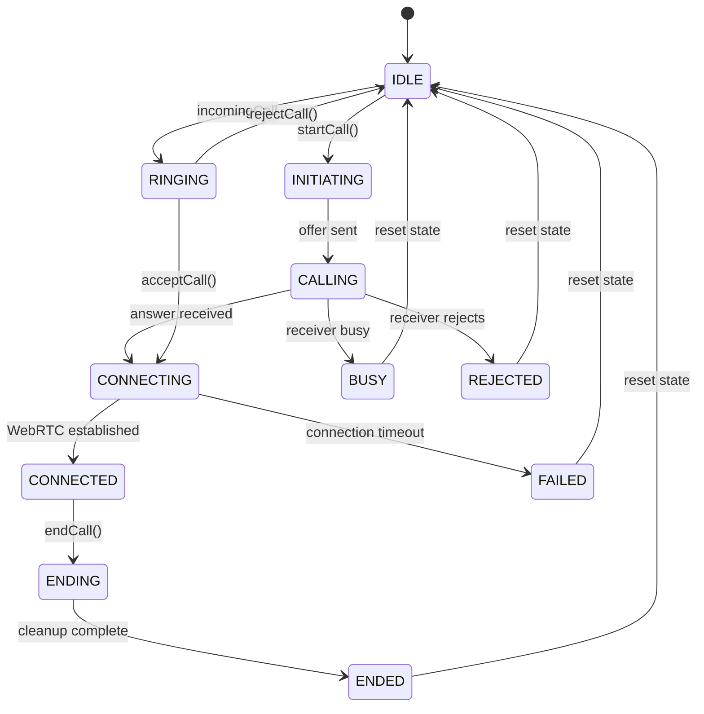

---

## Backend Session Lifecycle

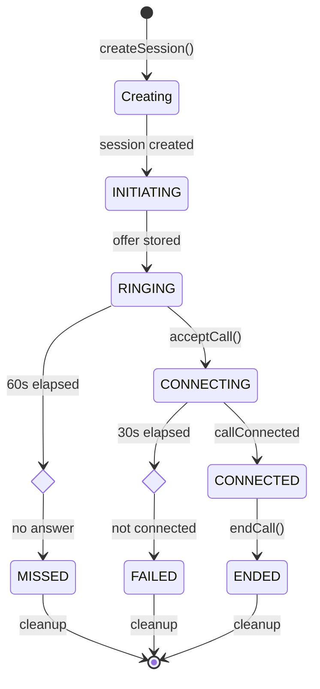

---

## Complete Architecture Overview

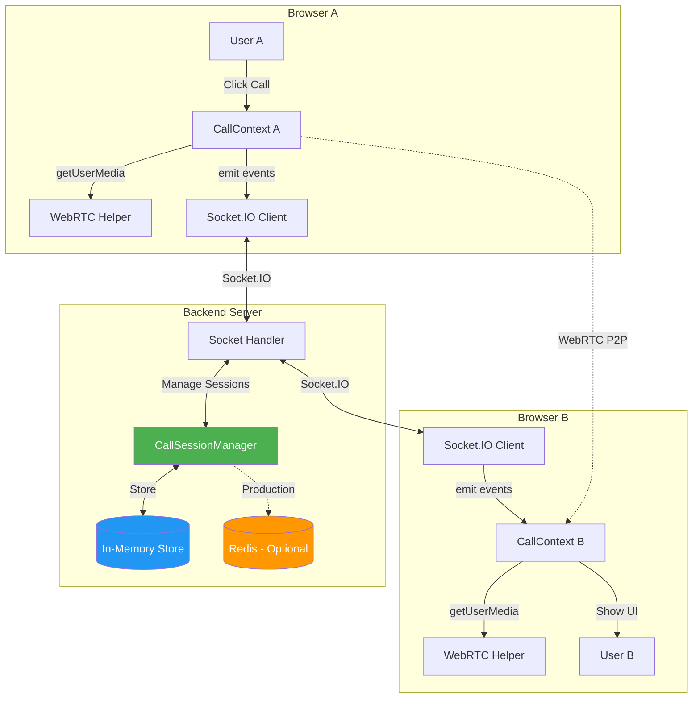

---

These diagrams show:
1. ✅ Complete call flow from start to end
2. ✅ Race condition resolution
3. ✅ Call recovery after refresh
4. ✅ Busy state handling
5. ✅ Rejection flow
6. ✅ Timeout handling
7. ✅ Connection recovery
8. ✅ Offline user handling
9. ✅ State machines
10. ✅ Architecture overview

You can view these diagrams using:
- GitHub (renders Mermaid automatically)
- VS Code (with Mermaid extension)
- [Mermaid Live Editor](https://mermaid.live/)
